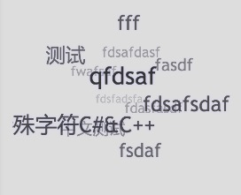

#Hexo Tag Cloud

[](https://badge.fury.io/js/hexo-tag-cloud)
[English Version ReadMe](https://github.com/MikeCoder/hexo-tag-cloud/blob/master/README.md)

Hexo 标签云插件

##效果图


这里是[效果预览站点](http://mikecoder.github.io)

##如何使用
+ 进入到 hexo 的根目录，然后在 `package.json` 中添加依赖: `"hexo-tag-cloud": "2.0.*"`
+ 然后执行 `npm install` 命令
+ 然后需要你去修改主题的 tagcloud 的模板
+ 这里以默认主题 landscape 为例，tagcloud 模板文件为 `hexo/themes/landscape/layout/_widget/tagcloud.ejs`
+ 然后将这个文件修改为如下内容：
```
<% if (site.tags.length){ %>
    <script type="text/javascript" charset="utf-8" src="/js/tagcloud.js"></script>
    <script type="text/javascript" charset="utf-8" src="/js/tagcanvas.js"></script>
    <div class="widget-wrap">
        <h3 class="widget-title"><%= __('tagcloud') %></h3>
        <div id="myCanvasContainer" class="widget tagcloud">
            <canvas width="250" height="250" id="resCanvas" style="width=100%">
                <%- tagcloud() %>
            </canvas>
        </div>
    </div>
<% } %>
```
+ 完成安装和显示，可以通过 hexo g && hexo s 来进行本地预览

##For Next Theme Users
+ You should insert the following code instead:
```

<script type="text/javascript" charset="utf-8" src="/js/tagcloud.js"></script>
<script type="text/javascript" charset="utf-8" src="/js/tagcanvas.js"></script>
<div class="widget-wrap">
    <h3 class="widget-title">Tag Cloug</h3>
    <div id="myCanvasContainer" class="widget tagcloud">
        <canvas width="250" height="250" id="resCanvas" style="width=100%">
            {{ list_tags() }}
        </canvas>
    </div>
</div>

```
@See [Issue 6](https://github.com/MikeCoder/hexo-tag-cloud/issues/6)

##Troubleshooting
提交 issue 和截图以及 log

##TODO
看 [Todo.md](./TODO.md)

##自定义
现在 hexo-tag-cloud 插件支持自定义啦。非常简单的步骤就可以改变你的标签云的字体和颜色，还有突出高亮。

+ 在你的博客根目录，找到 *_config.yml* 文件然后添加如下的配置项:
```
# hexo-tag-cloud
tag_cloud:
    textFont: Trebuchet MS, Helvetica
    textColour: \#333
    textHeight: 25
    outlineColour: \#E2E1D1
```
+ 然后使用 `hexo c && hexo g && hexo s` 来享受属于你自己的独一无二的标签云吧。

##致谢
+ **[TagCanvas](http://www.goat1000.com/tagcanvas.php)**
