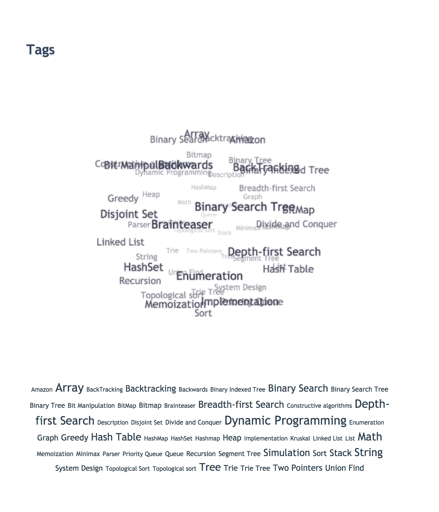

# hexo-tag-cloud

[](https://badge.fury.io/js/hexo-tag-cloud)
[](https://scrutinizer-ci.com/g/MikeCoder/hexo-tag-cloud/build-status/master)
[](https://scrutinizer-ci.com/g/MikeCoder/hexo-tag-cloud/?branch=master)

[中文说明版本](https://github.com/MikeCoder/hexo-tag-cloud/blob/master/README.ZH.md)

Yet, just another tag cloud plugin for hexo.

## How it looks like


And you can see online live demo by clicking [here](https://mhexo.github.io/archives/)

## How to Use

#### Install
+ go into your hexo system folder, and add depandence `"hexo-tag-cloud": "2.1.*"` to `package.json`
+ then do *npm install* command
+ then you need to change your theme layout file and add the following content to that file depended on your render system.

#### For ejs Users
+ For example, in its default theme landscape.
+ We should find `hexo/themes/landscape/layout/_widget/tagcloud.ejs` file and insert the following code.
```
<% if (site.tags.length) { %>
  <script type="text/javascript" charset="utf-8" src="<%- url_for('/js/tagcloud.js') %>"></script>
  <script type="text/javascript" charset="utf-8" src="<%- url_for('/js/tagcanvas.js') %>"></script>
  <div class="widget-wrap">
    <h3 class="widget-title"><%= __('tagcloud') %></h3>
    <div id="myCanvasContainer" class="widget tagcloud">
      <canvas width="250" height="250" id="resCanvas" style="width:100%">
        <%- tagcloud() %>
      </canvas>
    </div>
  </div>
<% } %>
```

If you are using [icarus](https://github.com/ppoffice/hexo-theme-icarus), please see [Issue #31](https://github.com/MikeCoder/hexo-tag-cloud/issues/31).

#### For swig Users
+ Here we use theme Next as an example.
+ You should insert the following code into `next/layout/_macro/sidebar.swig`.
```

  <script type="text/javascript" charset="utf-8" src="{{ url_for('/js/tagcloud.js') }}"></script>
  <script type="text/javascript" charset="utf-8" src="{{ url_for('/js/tagcanvas.js') }}"></script>
  <div class="widget-wrap">
    <h3 class="widget-title">Tag Cloud</h3>
    <div id="myCanvasContainer" class="widget tagcloud">
      <canvas width="250" height="250" id="resCanvas" style="width:100%">
        {{ list_tags() }}
      </canvas>
    </div>
  </div>

```
@See [Issue 6](https://github.com/MikeCoder/hexo-tag-cloud/issues/6)


#### For jade Users
+ eg. theme Apollo.
+ You can add change the container block code to the following in `apollo/layout/archive.jade`.
```
...
block container
    include mixins/post
    .archive
        h2(class='archive-year')= 'Tag Cloud'
        script(type='text/javascript', charset='utf-8', src=url_for("/js/tagcloud.js"))
        script(type='text/javascript', charset='utf-8', src=url_for("/js/tagcanvas.js"))
        #myCanvasContainer.widget.tagcloud(align='center')
            canvas#resCanvas(width='500', height='500', style='width:100%')
                !=tagcloud()
            !=tagcloud()
    +postList()
...
```

#### For pug Users

+ Here we use theme Butterfly as an example.
+ Then find this file: `Butterfly/layout/includes/widget/card_tags.pug` 
+ Modiefy the file as following code:

```
if site.tags.length
  .card-widget.card-tags
    .card-content
      .item-headline
        i.fa.fa-tags(aria-hidden="true")
        span= _p('aside.card_tags')
        script(type="text/javascript" charset="utf-8" src="/js/tagcloud.js")
        script(type="text/javascript" charset="utf-8" src="/js/tagcanvas.js")
        #myCanvasContainer.widget.tagcloud(align='center')
          canvas#resCanvas(width='200', height='200', style='width=100%')
            != tagcloud()
          != tagcloud({min_font: 16, max_font: 24, amount: 50, color: true, start_color: '#999', end_color: '#99a9bf'})
```


#### Last step
+ use `hexo clean && hexo g && hexo s` to see the change. hexo clean must be done before use `hexo g`.
+ **PS: Don't use the command `hexo g -d or hexo d -g`**, @See [Issue 7](https://github.com/MikeCoder/hexo-tag-cloud/issues/7)

## Customize
Now the hexo-tag-cloud plugin support customize feature. It's simple to change the color and the font for the tag cloud.

+ Add these config below to your *_config.yml* file(which under your blog root directory)

```
# hexo-tag-cloud
tag_cloud:
    textFont: 'Trebuchet MS, Helvetica'
    textColor: '#333'
    textHeight: 25
    outlineColor: '#E2E1D1'
    maxSpeed: 0.5 # range from [0.01 ~ 1]
    pauseOnSelected: false # true means pause the cloud tag movement when highlight a tag
```
+ then use `hexo clean && hexo g && hexo s` to enjoy your different tag cloud

## Troubleshooting
Submit issue please

# Thanks
+ **[TagCanvas](http://www.goat1000.com/tagcanvas.php)**
