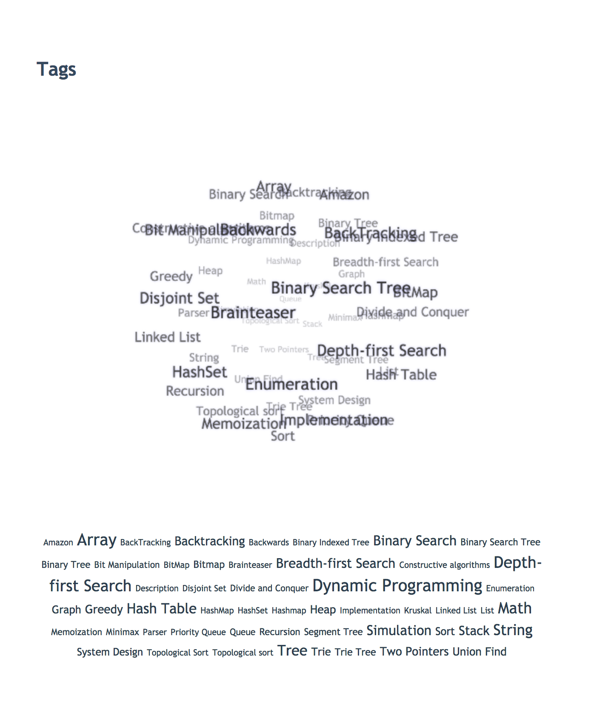

# hexo-tag-cloud


[](https://scrutinizer-ci.com/g/MikeCoder/hexo-tag-cloud/build-status/master)
[](https://scrutinizer-ci.com/g/MikeCoder/hexo-tag-cloud/?branch=master)

[中文说明版本](https://github.com/MikeCoder/hexo-tag-cloud/blob/master/README.ZH.md)

Yet, just another tag cloud plugin for hexo.

## How it looks like


And you can see online live demo by clicking [here](https://mhexo.github.io/archives/)

## AI-assisted install

The fastest way to add the tag cloud to any Hexo theme — works against
landscape, next, butterfly, icarus, fluid, or any custom theme via the
generic fallback.

### One-shot CLI (any shell)

From your Hexo site root:

```bash
# Dry-run: prints the diff that WOULD be written; does NOT touch any file.
npx hexo-tag-cloud install

# Apply: writes the managed `<!-- hexo-tag-cloud:begin/end -->` block
# into your active theme's sidebar/widget partial.
npx hexo-tag-cloud install --apply

# Re-running is a no-op when the block is unchanged. If you've edited
# the managed block by hand, the CLI exits 2 and prints a diff; pass
# --apply --force to overwrite your edits with the latest defaults.
```

Useful flags:

| flag | default | purpose |
|---|---|---|
| `--theme <name>` | autodetect from `_config.yml` | one of: landscape, next, butterfly, icarus, fluid, generic |
| `--theme-dir <path>` | `<cwd>/themes/<theme>` | for npm-installed themes (`hexo-theme-<name>`) |
| `--canvas-width <px>` | `500` | canvas width |
| `--canvas-height <px>` | `400` | canvas height |
| `--canvas-style <css>` | `margin: 0 auto;` | inline style |

Exit codes: `0` success/dry-run; `1` theme detection failure;
`2` modified-managed-block conflict (`--force` overrides);
`3` legacy hand-installed snippet detected (remove it first);
`4` write conflict.

### Claude skill (for AI agents)

If you use [Claude Code](https://docs.anthropic.com/en/docs/claude-code) or
any agent runtime that scans `~/.claude/skills/`, install the bundled
skill so your agent knows how to wire the tag cloud into a Hexo site
correctly (always dry-runs first; only applies after explicit user
approval):

```bash
npx hexo-tag-cloud install-skill           # → ~/.claude/skills/hexo-tag-cloud/
npx hexo-tag-cloud install-skill --dry-run # preview, no writes
npx hexo-tag-cloud install-skill --target ~/.config/agent/skills/
```

Restart your AI agent after installing so it picks up the new skill.

If you prefer the manual walkthrough, the per-engine instructions
below still work — the CLI just automates them.

## How to Use

#### Install
+ go into your hexo system folder, and add depandence `"hexo-tag-cloud": "2.1.*"` to `package.json`
+ then do *npm install* command
+ then you need to change your theme layout file and add the following content to that file depended on your render system.

#### For ejs Users
+ For example, in its default theme landscape.
+ We should find `hexo/themes/landscape/layout/_widget/tagcloud.ejs` file and insert the following code.
```
<% if (site.tags.length) { %>
  <script type="text/javascript" charset="utf-8" src="<%- url_for('/js/tagcloud.js') %>"></script>
  <script type="text/javascript" charset="utf-8" src="<%- url_for('/js/tagcanvas.js') %>"></script>
  <div class="widget-wrap">
    <h3 class="widget-title"><%= __('tagcloud') %></h3>
    <div id="myCanvasContainer" class="widget tagcloud">
      <canvas width="250" height="250" id="resCanvas" style="width:100%">
        <%- tagcloud() %>
      </canvas>
    </div>
  </div>
<% } %>
```

If you are using [icarus](https://github.com/ppoffice/hexo-theme-icarus), please see [Issue #31](https://github.com/MikeCoder/hexo-tag-cloud/issues/31).

#### For swig Users
+ Here we use theme Next as an example.
+ You should insert the following code into `next/layout/_macro/sidebar.swig`.
```

  <script type="text/javascript" charset="utf-8" src="{{ url_for('/js/tagcloud.js') }}"></script>
  <script type="text/javascript" charset="utf-8" src="{{ url_for('/js/tagcanvas.js') }}"></script>
  <div class="widget-wrap">
    <h3 class="widget-title">Tag Cloud</h3>
    <div id="myCanvasContainer" class="widget tagcloud">
      <canvas width="250" height="250" id="resCanvas" style="width:100%">
        {{ list_tags() }}
      </canvas>
    </div>
  </div>

```
@See [Issue 6](https://github.com/MikeCoder/hexo-tag-cloud/issues/6)


#### For jade Users
+ eg. theme Apollo.
+ You can add change the container block code to the following in `apollo/layout/archive.jade`.
```
...
block container
    include mixins/post
    .archive
        h2(class='archive-year')= 'Tag Cloud'
        script(type='text/javascript', charset='utf-8', src=url_for("/js/tagcloud.js"))
        script(type='text/javascript', charset='utf-8', src=url_for("/js/tagcanvas.js"))
        #myCanvasContainer.widget.tagcloud(align='center')
            canvas#resCanvas(width='500', height='500', style='width:100%')
                !=tagcloud()
            !=tagcloud()
    +postList()
...
```

#### For pug Users

+ Here we use theme Butterfly as an example.
+ Then find this file: `Butterfly/layout/includes/widget/card_tags.pug` 
+ Modiefy the file as following code:

```
if site.tags.length
  .card-widget.card-tags
    .card-content
      .item-headline
        i.fa.fa-tags(aria-hidden="true")
        span= _p('aside.card_tags')
        script(type="text/javascript" charset="utf-8" src="/js/tagcloud.js")
        script(type="text/javascript" charset="utf-8" src="/js/tagcanvas.js")
        #myCanvasContainer.widget.tagcloud(align='center')
          canvas#resCanvas(width='200', height='200', style='width=100%')
            != tagcloud()
          != tagcloud({min_font: 16, max_font: 24, amount: 50, color: true, start_color: '#999', end_color: '#99a9bf'})
```


#### Last step
+ use `hexo clean && hexo g && hexo s` to see the change. hexo clean must be done before use `hexo g`.
+ **PS: Don't use the command `hexo g -d or hexo d -g`**, @See [Issue 7](https://github.com/MikeCoder/hexo-tag-cloud/issues/7)

## Customize
Now the hexo-tag-cloud plugin supports customization. It's simple to change the color and the font for the tag cloud.

+ Add the config below to your *_config.yml* file (in your blog's root directory):

```yaml
# hexo-tag-cloud
tag_cloud:
    textFont: 'Trebuchet MS, Helvetica'   # any single family is auto-extended with a CJK fallback stack (v3+)
    textColor: '#333'
    textHeight: 25
    outlineColor: '#E2E1D1'
    maxSpeed: 0.5            # range from [0.01 ~ 1]
    pauseOnSelected: false   # true means pause the cloud tag movement when highlighting a tag
```
+ then run `hexo clean && hexo g && hexo s` to enjoy your customised tag cloud.

### Non-ASCII tags (CJK / Cyrillic / etc.)
Tags written in Chinese / Japanese / Korean / Cyrillic and other non-Latin scripts render correctly out of the box from v3.0.0. The default `textFont` (and any single-family value you supply) is automatically extended with a cross-platform CJK fallback stack (PingFang SC, Hiragino Sans GB, Microsoft YaHei, Source Han Sans CN, Noto Sans CJK SC, sans-serif), so glyphs that the primary font lacks fall through to the next family rather than rendering as `□`. If you supply a multi-family value such as `'Comic Sans MS, sans-serif'` your value is honoured verbatim.

## Troubleshooting

### `&#NN;` codes (e.g. `&#43;` instead of `+`) appear ON the canvas
Stock TagCanvas v2.9 reads tag text as a literal DOM string, and stock hexo's `tagcloud()` helper outputs HTML entities that the browser decodes correctly. If you see literal entity codes painted on the canvas, your hexo build chain is double-escaping the `<a>` text content before TagCanvas reads it — most commonly via plugins that re-serialise generated HTML through cheerio (`hexo-asset-image`, custom HTML post-processors, etc.). Audit your hexo plugin list for anything that touches `<a>` text content; v3 ships a regression e2e test (`tests/e2e/smoke.spec.js`) that locks in the literal-text round-trip on a clean fixture as evidence of the upstream behaviour.

### Other issues
Submit an issue with your `npm list`, `_config.yml`, and the contents of `public/js/tagcloud.js` after `hexo generate`.

# Thanks
+ **[TagCanvas](http://www.goat1000.com/tagcanvas.php)**
